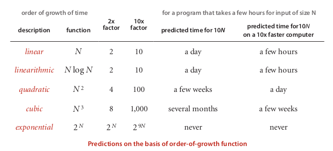
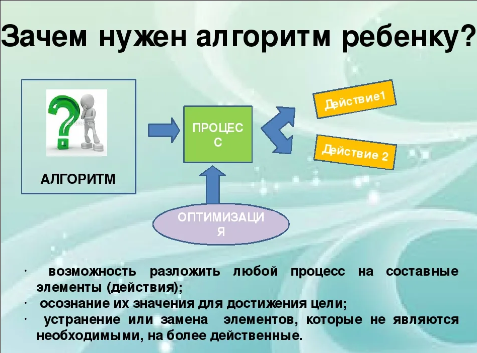
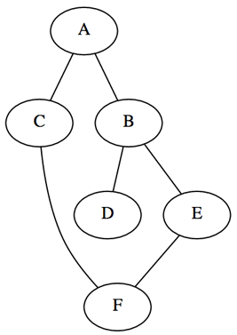
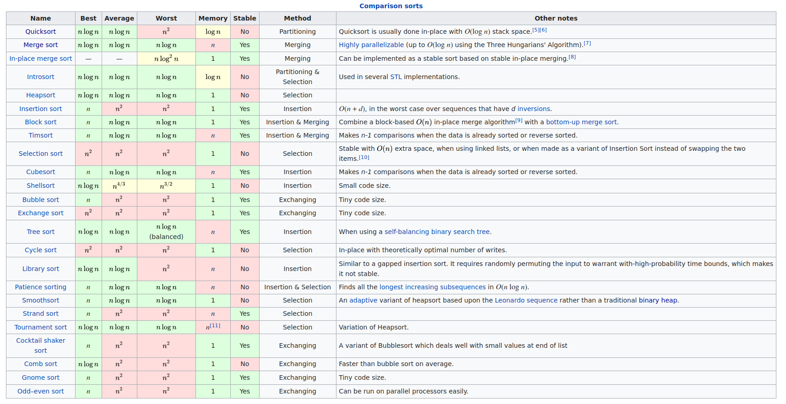
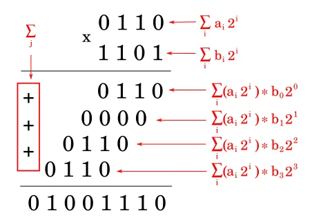
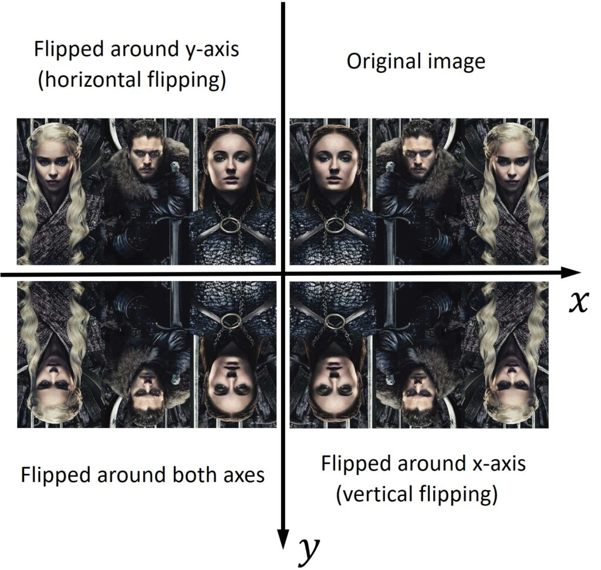
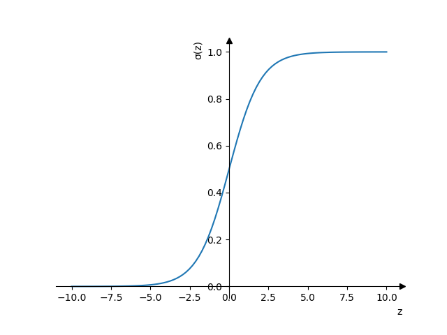

- [Зачем нужны алгоритмы?](#org5c673a1)
  - [Задача](#orgf0711a1)
- [Зачем нужны алгоритмы?](#org6a5c08b)
- [Результат наивной реализации](#org5b3b38b)
- [Бинарный поиск](#org64181b0)
- [Быстрый ThreeSum](#org6a2fe7b)
- [Результат быстрого ThreeSum](#org3758ab0)
- [Алгоритмическая сложность](#org39a9ffd)
- [Нужны ли алгоритмы backend-разработчику?](#org9314126)
- [Какие алгоритмы нужнее всего?](#orgbf97b79)
  - [Зависит от задачи, области применения](#org9f6c965)
- [Структуры данных. Очередь](#org553ed89)
- [Структуры данных. Стек](#org0c9a7be)
- [Структуры данных. Граф](#org0392f7e)
- [Поиск вглубину. Depth-First Search](#org2a6d72c)
- [Глупая сортировка / сортировка дурака](#org2039f34)
- [Результат глупой сортировки](#org2136839)
- [Пузырьковая сортировка](#orge8778fb)
- [Результат пузырьковой сортировки](#orgf367f7f)
- [Сортировка слиянием (Merge Sort)](#org7d2275b)
- [Результат Merge Sort](#orgee8866f)
- [Сравнение алгоритмов сортировки](#orgf1d31ee)
- [Умножение двух чисел](#orgb69a4a9)
- [Умножение двоичных чисел](#org172d0bc)
- [Алгоритм Каратцубы](#org3c57f02)
- [Алгоритм Каратцубы](#org7325d7c)
- [Алгоритм Каратцубы](#orgc36b8b2)
- [Умножение матриц](#org2304ee1)
- [Умножение матриц](#org7f59116)
- [Умножение матриц](#org9496c07)
- [Алгоритм Штрассена](#orgbe9ad69)
- [Алгоритм Штрассена](#orgdbf2f85)
- [векторизация](#org3048709)
- [Пример умножения матриц](#org0f4b481)
- [Логистическая регрессия](#org46a9de6)
- [Котики!](#org5784c51)
- [Tensorflow](#orga975b48)
- [Как изучать алгоритмы](#org0e605c0)
- [Вопросы-ответы](#org357b020)


<a id="org5c673a1"></a>

# Зачем нужны алгоритмы?


<a id="orgf0711a1"></a>

## Задача

Подсчитать, какое количество сочетаний по три элементов входного массива даст в сумме 0.  


<a id="org6a5c08b"></a>

# Зачем нужны алгоритмы?

```python

def counter(a: List[int]) -> int:
    N:int = len(a)
    counter:int = 0
    for i in range(N):
        for j in range(i+1, N):
            for k in range(j+1, N):
                s = a[i] + a[j] + a[k]
                if s == 0:
                    counter += 1
    return counter


```


<a id="org5b3b38b"></a>

# Результат наивной реализации

>   % python ./first\_try.py 1K  
> 2 вызовов для 1K данных: лучший результат равен 42.02  
>   % python ./first\_try.py 2K  
> 2 вызовов для 2K данных: лучший результат равен 340.84  


<a id="org64181b0"></a>

# Бинарный поиск

```python


def binary_search(
        lst:List[int], target:int
) -> int:
    start:int = 0
    end:int = len(lst) - 1
    while(start <= end):
        mid = (start + end) // 2
        if(lst[mid] > target):
            end = mid - 1
        elif(lst[mid] < target):
            start = mid + 1
        else:
            return mid
    return -1
```


<a id="org6a2fe7b"></a>

# Быстрый ThreeSum

```python


def counter(a: List[int]) -> int:
  # O(NlogN)
  arr:List[int] = sorted(a)
  N:int = len(arr)
  counter:int = 0
  for i in range(N):
    for j in range(i+1, N):
      # O(logN)
      if binary_search(
        arr, -(arr[i]+arr[j])
      ) > j:
        counter += 1
  return counter

```


<a id="org3758ab0"></a>

# Результат быстрого ThreeSum

>   % python fast\_threesum.py 1K  
> 2 вызовов для 1K данных: лучший результат равен 1.64  
>   % python fast\_threesum.py 2K  
> 2 вызовов для 2K данных: лучший результат равен 7.36  
>   % python fast\_threesum.py 4K  
> 2 вызовов для 4K данных: лучший результат равен 31.31  


<a id="org39a9ffd"></a>

# Алгоритмическая сложность

  


<a id="org9314126"></a>

# Нужны ли алгоритмы backend-разработчику?

  


<a id="orgbf97b79"></a>

# Какие алгоритмы нужнее всего?


<a id="org9f6c965"></a>

## Зависит от задачи, области применения

-   алгоритмы на строках  
    нужны например биоинформатикам, для работы с последовательностями ДНК
-   алгоритмы на деревьях  
    -   компиляторы
    -   машинное обучение
    -   построение маршрутов
    -   парсинг сайтов


<a id="org553ed89"></a>

# Структуры данных. Очередь

-   **FIFO:** First In First Out

  


<a id="org0c9a7be"></a>

# Структуры данных. Стек

-   **LIFO:** Last In First Out

  


<a id="org0392f7e"></a>

# Структуры данных. Граф

```python
graph = {
    'A': ['B', 'C'],
    'B': ['A', 'D', 'E'],
    'C': ['A', 'F'],
    'D': ['B'],
    'E': ['B', 'F'],
    'F': ['C', 'E']
}
```

  


<a id="org2a6d72c"></a>

# Поиск вглубину. Depth-First Search

```python

def dfs(graph, start, goal):
  stack = [(start, [start])]
  while stack:
    (v, p) = stack.pop()
    paths = set(graph[v]) - set(p)
    for nxt in paths:
      if nxt == goal:
        yield p + [nxt]
      else:
        stack.append((nxt, p+[nxt]))
print(list(dfs(graph, 'A', 'F')))
```

    [['A', 'C', 'F'], ['A', 'B', 'E', 'F']]


<a id="org2039f34"></a>

# Глупая сортировка / сортировка дурака

```python
def sort_alg(l):
  while True:
    c = 0
    for i in range(len(l)-1):
      if l[i] > l[i+1]:
        l[i+1],l[i] = l[i],l[i+1]
      else:
        c += 1
    if c == (len(l) - 1): return l

```

```python

print(sort_alg([1, 3, 2, 0]))
```

    [0, 1, 2, 3]


<a id="org2136839"></a>

# Результат глупой сортировки

-   Эффективность **глупой сортировки**: $\mathcal{O}(N^{3})$

>   % ./fool\_sort.py 1K  
> 2 вызовов для 1K данных: лучший результат равен 0.12  
>   % ./fool\_sort.py 2K  
> 2 вызовов для 2K данных: лучший результат равен 0.53  
>   % ./fool\_sort.py 4K  
> 2 вызовов для 4K данных: лучший результат равен 2.15  


<a id="orge8778fb"></a>

# Пузырьковая сортировка

```python
def sort_alg(l):
  for i in range(len(l)):
    for j in range(len(l[i+1:])):
      if l[j] > l[j+1]:
        l[j], l[j+1] = (l[j+1], l[j])
  return l

print(sort_alg([1, 3, -1, 2, 0]))
```

    [-1, 0, 1, 2, 3]


<a id="orgf367f7f"></a>

# Результат пузырьковой сортировки

-   Эффективность **пузырьковой сортировки**: $\mathcal{O}(N^{2})$

>   % ./bubble\_sort.py 1K  
> 2 вызовов для 1K данных: лучший результат равен 0.11  
>   % ./bubble\_sort.py 2K  
> 2 вызовов для 2K данных: лучший результат равен 0.45  
>   % ./bubble\_sort.py 4K  
> 2 вызовов для 4K данных: лучший результат равен 1.86  


<a id="org7d2275b"></a>

# Сортировка слиянием (Merge Sort)

-   <span class="underline"><span class="underline">[Код](https://gist.github.com/pimiento/72ea7cc917e1e732f834e307f6998d89)</span></span>
-   <span class="underline"><span class="underline">[мультик](https://www.youtube.com/watch?v=JSceec-wEyw)</span></span>

Сортировка слиянием позволяет нам распараллелить процесс сортировки. Это очень эффективно на больших данных и широко используется в алгоритмах map/reduce.  


<a id="orgee8866f"></a>

# Результат Merge Sort

-   Эффективность **Merge Sort**: $\mathcal{O}(NlogN)$

>   % ./merge\_sort.py 1K  
> 2 вызовов для 1K данных: лучший результат равен 0.01  
>   % ./merge\_sort.py 4K  
> 2 вызовов для 4K данных: лучший результат равен 0.03  
>   % ./merge\_sort.py 8K  
> 2 вызовов для 8K данных: лучший результат равен 0.07  
>   % ./merge\_sort.py 32K  
> 2 вызовов для 32K данных: лучший результат равен 0.31  


<a id="orgf1d31ee"></a>

# Сравнение алгоритмов сортировки

  


<a id="orgb69a4a9"></a>

# Умножение двух чисел

\begin{equation}
\opmul{5678}{1234}\qquad
\end{equation}


<a id="org172d0bc"></a>

# Умножение двоичных чисел

  
*Можно ли лучше?*  


<a id="org3c57f02"></a>

# Алгоритм Каратцубы

```python
x = 5678
y = 1234

a = 56; b = 78
c = 12; d = 34
```


<a id="org7325d7c"></a>

# Алгоритм Каратцубы

```python

# step1
step1 = a * c
# step2
step2 = b * d
# step3
a_b = a + b
c_d = c + d
step3 = a_b * c_d
# step4:
# step3 - step2 - step1
step4 = step3 - step2 - step1
```


<a id="orgc36b8b2"></a>

# Алгоритм Каратцубы

```python

line1 = step1 * 10**4
line2 = step2
line3 = step4 * 10**2
result = (
    line1
    + line2
    + line3
)
print(result)
```

    7006652


<a id="org2304ee1"></a>

# Умножение матриц

\begin{equation}
\left[ \begin{array}{ccc} A & B \\ C & D \\ \end{array} \right]
\times
\left[ \begin{array}{ccc} E & F \\ G & H \\ \end{array} \right]
= \left[ \begin{array}{ccc} AE + BG & AF + BH \\ CE + DG & CF + DH \\ \end{array} \right]
\end{equation}


<a id="org7f59116"></a>

# Умножение матриц

```python
def mxm(A, X):
  n = len(A)    # A: n×m
  m = len(A[0])
  p = len(X[0]) # X: m×p
  B = [[0] * p] * n
  for i in range(n):
    for j in range(p):
      for k in range(m):
        B[i][j] += A[i][k]*X[k][j]
  return B
```

**Где ошибка в этом коде?**  


<a id="org9496c07"></a>

# Умножение матриц

```python
def mxm(A, X):
  n = len(A)    # A: n×m
  m = len(A[0])
  p = len(X[0]) # X: m×p
  B = [[0] * p for _ in range(n)]
  for i in range(n):
    for j in range(p):
      for k in range(m):
        B[i][j] += A[i][k]*X[k][j]
  return B
```

<div class="org-center">
<p>
\(O(n^{3})\)<br />
<i>Можно ли лучше?</i><br />
</p>
</div>


<a id="orgbe9ad69"></a>

# Алгоритм Штрассена

\begin{normalsize}
\left[ \begin{array}{cccc} 11 & 12 & 13 & 14 \\ 21 & 22 & 23 & 24 \\ 31 & 32 & 33 & 34 \\ 41 & 42 & 43 & 44 \\ \end{array} \right] =
\left[ \begin{array}{cc} A & B \\ C & D \\ \end{array} \right]
\end{normalsize}

\begin{normalsize}
\left[ \begin{array}{cccc} 11 & 21 & 31 & 41 \\ 12 & 22 & 32 & 42 \\ 13 & 23 & 33 & 43 \\ 14 & 24 & 34 & 44 \\ \end{array} \right] =
\left[ \begin{array}{cc} E & F \\ G & H \\ \end{array} \right]
\end{normalsize}


<a id="orgdbf2f85"></a>

# Алгоритм Штрассена

\begin{array}{l}
P_{1} = A(F - H), \\
P_{2} = (A + B)H, \\
P_{3} = (C + D)E, \\
P_{4} = D(G - E), \\
P_{5} = (A + D)(E + H), \\
P_{6} = (B - D)(G + H), \\
P_{7} = (A - C)(E + F) \\
\end{array}

\begin{footnotesize}
\left[ \begin{array}{cc} AE+BG & AF+BH \\ CE+DG & CF+DH \end{array} \right] =
\left[ \begin{array}{ll} P_{5} + P_{4} - P_{2} + P_{6} & P_{1} + P_{2} \\ P_{3} + P_{4} & P_{1} + P_{5} - P_{3} + P_{7} \end{array} \right]
\end{footnotesize}


<a id="org3048709"></a>

# векторизация

-   Большинство операций процессора это SISD: Single Instruction Single Data  
    
    | 0     | 1        | 2        | 3        |
    | a[0]= | not used | not used | not used |
    | b[0]+ | not used | not used | not used |
    | c[0]  | not used | not used | not used |
-   Процессор может поддерживать специальные регистры для <span class="underline"><span class="underline">[SIMD](https://ru.wikipedia.org/wiki/SIMD)</span></span>: Single Instruction Multiple Data  
    
    | 0     | 1     | 2     | 3     |
    | a[0]= | a[1]= | a[2]= | a[3]= |
    | b[0]+ | b[1]+ | b[2]+ | b[3]+ |
    | c[0]  | c[1]  | c[2]  | c[3]  |


<a id="org0f4b481"></a>

# Пример умножения матриц

<span class="underline"><span class="underline">[Article](https://datahacker.rs/003-how-to-resize-translate-flip-and-rotate-an-image-with-opencv/)</span></span>  

  


<a id="org46a9de6"></a>

# Логистическая регрессия

$z = w_{0}x + w_{1}x + \dots + w_{n}x + b$   
$a = \frac{1}{1+e^{-z}}$  

  


<a id="org5784c51"></a>

# Котики!

<span class="underline"><span class="underline">[GitHub](https://github.com/pimiento/numerical_algorithms_ML_webinar/blob/master/nn_model.py)</span></span>  


<a id="orga975b48"></a>

# Tensorflow

<span class="underline"><span class="underline">[Colab](https://colab.research.google.com/drive/1peolUQzHOVC4QVELMCBO1zluc1-pNsma?usp=sharing)</span></span>  


<a id="org0e605c0"></a>

# Как изучать алгоритмы

-   <span class="underline"><span class="underline">[Яндекс.Практикум](https://practicum.yandex.ru/algorithms/)</span></span>
-   Coursera (<span class="underline"><span class="underline">[Part I](https://www.coursera.org/learn/algorithms-part1)</span></span>, <span class="underline"><span class="underline">[Part II](https://www.coursera.org/learn/algorithms-part2)</span></span>)
-   Альманах алгоритмов: Т.Кормен, Ч.Лейзерсон, Р.Ривест, К.Штайн «Алгоритмы. Построение и анализ.»
-   [Порешать задачки. Timus](https://acm.timus.ru/?locale=ru)


<a id="org357b020"></a>

# Вопросы-ответы


